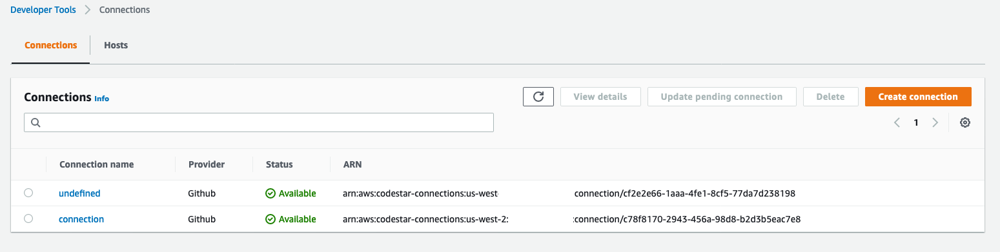

# multi-arch-docker-image-demo

The purpose of this demonstration is to show how to create a pipeline using Code Pipeline that builds multi architecture Docker images and deploy this image inside a Kubernetes cluster.

Using a combination of architecture-specific tags and an associated Docker manifest, we can achieve one-size-fits-all architecture agnostic image pulls from our repo. Let's introduce the concept of manifests first, then we will cover how to do it.

A **Docker manifest** contains information about an image, such as layers, size, and digest. The docker manifest command also gives users additional information such as the os and architecture an image was built for.

## Prerequisites

- [kubectl](https://kubernetes.io/docs/tasks/tools/install-kubectl/)
- [eksctl](https://docs.aws.amazon.com/eks/latest/userguide/eksctl.html#installing-eksctl)
- [aws-cli](https://docs.aws.amazon.com/pt_br/cli/latest/userguide/cli-chap-install.html)

## Deploy EKS Cluster

We are going to use eksctl to deploy our EKS cluster inside our AWS account.

Open **eks-configs/cluster-template.yaml** and change the region that you want to deploy the cluster.

```yaml
metadata:
  name: multi-arch-demo-cluster
  region: <REGION>
  version: "1.18"

availabilityZones: ["<REGION>a", "<REGION>b", "<REGION>c"]
```

Change the REGION variable, will look like this.

```yaml
metadata:
  name: multi-arch-demo-cluster
  region: us-west-2
  version: "1.18"

availabilityZones: ["us-west-2a", "us-west-2b", "us-west-2c"]
```

Crete cluster:

```shell
eksctl create cluster -f eks-configs/cluster-template.yaml
```

Wait 10 to 15 minutes to create your cluster.

## Creating Multi Architecture Pipeline

First of all you will need to **fork this repository to your GitHub Account** so you can use the repository connected to you CodePipeline, so you will need to create a GitHub connection inside the Developer Tools in AWS console.

[Create GitHub Connection](https://docs.aws.amazon.com/dtconsole/latest/userguide/connections-create-github.html)

<p align="center"> 

</p>

Execute 

