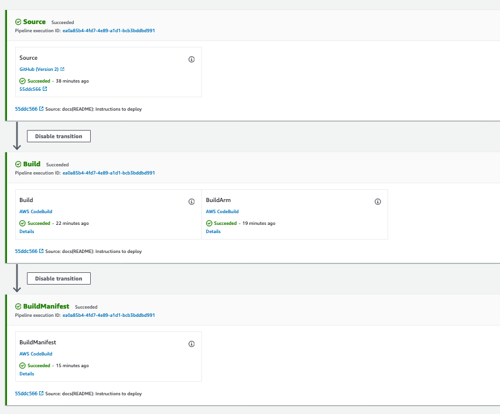

# multi-arch-docker-image-demo

The purpose of this demonstration is to show how to create a pipeline using Code Pipeline that builds multi architecture Docker images (x64 and arm64) and deploy this image inside a Kubernetes cluster.

Using a combination of architecture-specific tags and an associated Docker manifest, we can achieve one-size-fits-all architecture agnostic image pulls from our repo. Let's introduce the concept of manifests first, then we will cover how to do it.

A **Docker manifest** contains information about an image, such as layers, size, and digest. The docker manifest command also gives users additional information such as the os and architecture an image was built for.

## Prerequisites

- [kubectl](https://kubernetes.io/docs/tasks/tools/install-kubectl/)
- [eksctl](https://docs.aws.amazon.com/eks/latest/userguide/eksctl.html#installing-eksctl)
- [aws-cli](https://docs.aws.amazon.com/pt_br/cli/latest/userguide/cli-chap-install.html)

## Deploy EKS Cluster

> :warning: Fork this repository to your GitHub account in order to work the GitHub connection, all the steps of this demonstration you have to do in your repository.

We are going to use eksctl to deploy our EKS cluster inside our AWS account.

Open **eks-configs/cluster-template.yaml** and change the region that you want to deploy the cluster.

```yaml
metadata:
  name: multi-arch-demo-cluster
  region: <REGION>
  version: "1.18"

availabilityZones: ["<REGION>a", "<REGION>b", "<REGION>c"]
```

Change the REGION variable, will look like this.

```yaml
metadata:
  name: multi-arch-demo-cluster
  region: us-west-2
  version: "1.18"

availabilityZones: ["us-west-2a", "us-west-2b", "us-west-2c"]
```

Crete cluster:

```shell
eksctl create cluster -f eks-configs/cluster-template.yaml
```

Wait 10 to 15 minutes to create your cluster.

## Creating Multi Architecture Pipeline

First of all you will need to **fork this repository to your GitHub Account** so you can use the repository connected to you CodePipeline, so you will need to create a GitHub connection inside the Developer Tools in AWS console.

[Create GitHub Connection](https://docs.aws.amazon.com/dtconsole/latest/userguide/connections-create-github.html)

<p align="center"> 

</p>

Now in your forked repository from this one you have to change some variables inside Codebuild spec files.

Go to **configuration/** and change the following.

```yaml
version: 0.2
env:
    variables:
        IMAGE_REPO_NAME: "multi-arch-repo"
        AWS_ACCOUNT_ID: "<AWS_ACCOUNT_ID>"
        IMAGE_TAG: "latest-amd64"
```

**Replace AWS_ACCOUNT_ID to your aws account ID, do the same in all the 3 files.**

> :warning: Do not forget to push the changes, Codebuild will get the spec files from the repository.

Create CodeBuild projects and CodePipeline pipeline using Cloudformation, execute:

```shell
aws cloudformation create-stack --stack-name multi-architecture-stack --template-body file://cloudformation/cloudformation.yaml --parameters ParameterKey=GitHubCloneUrl,ParameterValue=<YOU_FORKED_GIT_URL> ParameterKey=RepositoryBranch,ParameterValue=<DEFAULT_BRANCH> ParameterKey=RepositoryName,ParameterValue=<__YOUR_USER__>/multi-arch-docker-images ParameterKey=ConnectionArn,ParameterValue=<YOUR_CONNECTION_ARN> --capabilities CAPABILITY_NAMED_IAM
```

Access the CodePipeline console and check if your pipeline ran successfully.

<p align="center"> 

</p>

## Provision Node Application inside our EKS Cluster

We provisioned 2 Managed Nodegroups, one using x86 architecture and the other one using arm, since we built our application image in two different containers and join then with Docker Manifest, we are able to use one Image URI to provision in our EKS cluster.

The EKS is able to identify the architecture of our image and deploy it on the correct Node.

Go to the AWS Console and get the multi architecture Image URI.

<p align="center"> 

</p>

- **latest-arm64v8:** Is the image the we built using arm64 architecture.

- **latest-amd64:** Is the image the we built using x86 architecture.

- **latest:** It's our Docker Manifest image.

Open **eks-configs/deployment.yaml** and change the image URI.

```yaml
spec:
      containers:
      - name: main
        image: __IMAGE_URI__
        ports:
        - containerPort: 3000
```

> Remember that you have to use the image with the lastet tag

```yaml
spec:
      containers:
      - name: main
        image: xxxxxxxx.dkr.ecr.us-west-2.amazonaws.com/multi-arch-repo:latest
        ports:
        - containerPort: 3000
```

After that just apply our manifest executing:

```shell
kubectl apply -f eks-configs/deployment.yaml
```

It will provision a Service of type LoadBalancer and 4 Pods.

Let's get our service URL:

```shell
kubectl get svc/node-app-service -ndefault
```

<p align="center"> 

</p>

Copy the EXTERNAL-IP and paste it into your browser, will look like this:

Since we are using Loadbalancer it is doing Round-robin to our Pods inside our Kubernetes cluster, this application shows to you if the pod that you reached is running on x86 architecture or arm.

POD running inside arm node.

<p align="center"> 

</p>

POD running inside x86 node.

<p align="center"> 

</p>